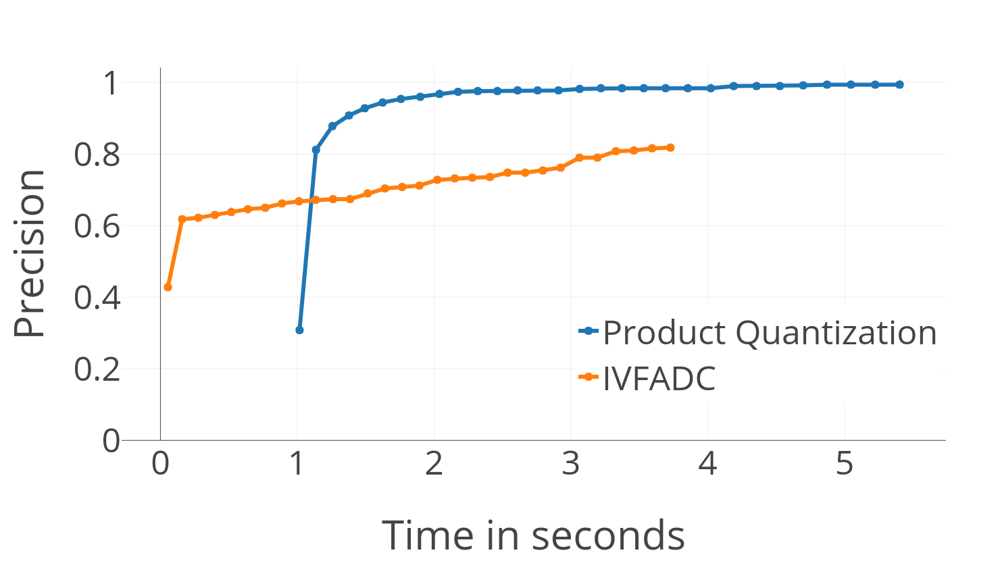
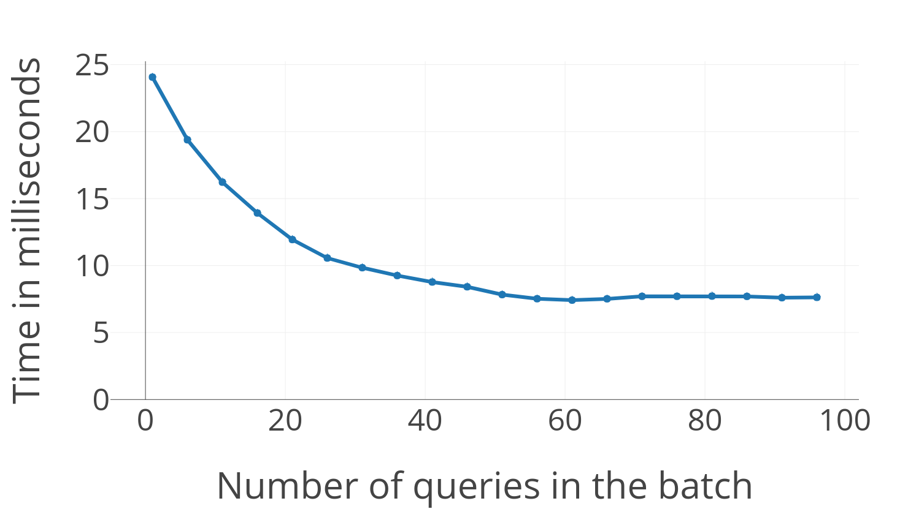

#  FREDDY: Fast Word Embeddings in Database Systems

FREDDY is a system based on Postgres which is able to use word embeddings exhibit the rich information encoded in textual values. Database systems often contain a lot of textual values which express a lot of latent semantic information which can not be exploited by standard SQL queries. We developed a Postgres extension which provides UDFs for word embedding operations to compare textual values according to there syntactic and semantic meaning.      

## Word Embedding operations

### Similarity Queries
```
cosine_similarity(float[], float[])
```
**Example**
```
SELECT keyword
FROM keywords AS k
INNER JOIN word_embeddings AS v ON k.keyword = v.word
INNER JOIN word_embeddings AS w ON w.word = 'comedy'
ORDER BY cosine_similarity(w.vector, v.vector) DESC;
```

### Analogy Queries based on 3CosAdd
```
cosadd_pq(float[], float[], float[])
cosadd_pq(varchar, varchar, varchar)
```
**Example**
```
SELECT *
FROM cosadd_pq('Francis_Ford_Coppola', 'Godfather', 'Christopher_Nolan');

```
### K Nearest Neighbour Queries

```
k_nearest_neighbour_ivfadc(float[], int)
k_nearest_neighbour_ivfadc(varchar, int)
```
**Example**
```
SELECT m.title, t.word, t.squaredistance
FROM movies AS m, k_nearest_neighbour_ivfadc(m.title, 3) AS t
ORDER BY m.title ASC, t.squaredistance DESC;
```

### K Nearest Neighbour Queries with Specific Output Set

```
top_k_in_pq(varchar, int, varchar[]);
```
**Example**
```
SELECT * FROM
top_k_in_pq('Godfather', 5, ARRAY(SELECT title FROM movies));
```

### Grouping

```
grouping_func(varchar[], varchar[])
```
**Example**
```
SELECT term, groupterm
FROM grouping_func(ARRAY(SELECT title FROM movies), '{Europe,America}');
```

## Indexes

We implemented two types of index structures to accelerate word embedding operations. One index is based on [product quantization](http://ieeexplore.ieee.org/abstract/document/5432202/) and one on IVFADC (inverted file system with asymmetric distance calculation). Product quantization provides a fast approximated distance calculation. IVFADC is even faster and provides a non-exhaustive approach which also uses product quantization.

| Method                           | Response Time | Precision     |
| ---------------------------------| ------------- | ------------- |
| Exact Search                     | 8.79s         | 1.0           |
| Product Quantization             | 1.06s         | 0.38          |
| IVFADC                           | 0.03s         | 0.35          |
| IVFADC (batchwise)               | 0.01s         | 0.35          |
| Product Quantization (postverif.)| 1.29s         | 0.87          |
| IVFADC (postverif.)              | 0.26s         | 0.65          |

**Parameters:**
* Number of subvectors per vector: 12
* Number of centroids for fine quantization (PQ and IVFADC): 1024
* Number of centroids for coarse quantization: 1000

<!--  -->

## Post verification

The results of kNN queries could be improved by using post verification. The idea behind this is to obtain a larger result set with an approximated kNN search (more than k results) and run an exact search on the results afterwards.

To use post verification within a search process, use `k_nearest_neighbour_pq_pv` and `k_nearest_neighbour_ivfadc_pv`.

**Example**
```
SELECT m.title, t.word, t.squaredistance
FROM movies AS m, k_nearest_neighbour_ivfadc_pv(m.title, 3, 500) AS t
ORDER BY m.title ASC, t.squaredistance DESC;
```

The effect of post verification on the response time and the precision of the results is shown below.



## Batchwise search
It is possible to execute multiple ivfadc search queries in batches. Therefore you can use the `k_nearest_neighbour_ivfadc_batch` function. This accelerates the calculation. In general, the response time per query drops down with increasing batch size.

**Example**
```
SELECT *
FROM k_nearest_neighbour_ivfadc_batch(ARRAY(SELECT title FROM movies), 3);
```
The response time per query in dependence of the batch size is shown below.

 

## Setup
At first, you need to set up a [Postgres server](https://www.postgresql.org/). You have to install [faiss](https://github.com/facebookresearch/faiss) and a few other python libraries to run the import scripts.

To build the extension you have to switch to the "freddy_extension" folder. Here you can run `sudo make install` to build the shared library and install the extension into the Postgres server. Hereafter you can add the extension in PSQL by running `CREATE EXTENSION freddy;`

## Index creation
To use the extension you have to provide word embeddings. The recommendation here is the [word2vec dataset from google news](https://drive.google.com/file/d/0B7XkCwpI5KDYNlNUTTlSS21pQmM/edit?usp=sharing). The scripts for the index creation process are in the "index_creation" folder. You have to download the dataset and put it into a "vectors" folder, which should be created in the root folder in the repository. After that, you can transform it into a text format by running the "transform_vecs.py" script.

```
mkdir vectors
wget -c "https://s3.amazonaws.com/dl4j-distribution/GoogleNews-vectors-negative300.bin.gz" -P vectors
gzip --decompress vectors/GoogleNews-vectors-negative300.bin.gz
cd index_creation
python3 transform_vecs.py
```

Then you can fill the database with the vectors with the "vec2database.py" script. However, at first, you need to provide information like database name, username, password etc. Therefore you have to change the properties in the "db_config.json" file.

After that, you can use the "vec2database.py" script to add the word vectors to the database. You might have to adopt the configuration files "word_vecs.json" and "word_vecs_norm.json" for the word vector tables.
Execute the following code (this can take a while):

```
python3 vec2database.py config/vecs_config.json
python3 vec2database.py config/vecs_config_norm.json
```

To create the product quantization Index you have to execute "pq_index.py":

```
python3 pq_index.py config/pq_config.json
```

The IVFADC index tables can be created with "ivfadc.py":

```
python3 ivfadc.py config/ivfadc_config.json
```

After all index tables are created, you might execute `CREATE EXTENSION freddy;` a second time. To provide the table names of the index structures for the extension you can use the `init` function in the PSQL console (If you used the default names this might not be necessary) Replace the default names with the names defined in the JSON configuration files:

```
SELECT init('google_vecs', 'google_vecs_norm', 'pq_quantization', 'pq_codebook', 'fine_quantization', 'coarse_quantization', 'residual_codebook')
```

## Store and load index files

The index creation scripts "pq_index.py" and "ivfadc.py" are able to store index structures into binary files. To enable the generation of these binary files, change the `export_to_file` flag in the JSON config file to `true` and define an output destination by setting `export_name` to the export path.

To load an index file into the database you have to use the "load_index.py" script. The script requires an index file, the type of the index (either "pq" or "ivfadc") and the JSON file for the index configuration (same file as used for creating an index). Use the following command to create a product quantization index stored in a "dump.idx" file:

```
python3 load_index.py dump.idx pq pq_config.json
```
